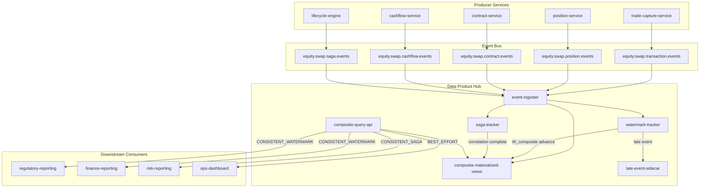

# Dependency-Aware Watermark Composite Consistency Design

## 1) Purpose

Define an implementation-ready design for composite data consistency in the Data Product Hub (ODS) when multiple independent data products must be read together:

- Transaction (from `trade-capture-service`)
- Position (from `position-service`)
- Contract (from `contract-service`)
- Cashflow (from `cashflow-service`)

This design combines:

1. Dependency-aware watermarks for continuous stream-level consistency
2. Saga boundary events for per-transaction completeness

---

## 2) Problem Statement

Independent services publish domain events at different times. For composite reads (for example, Contract + Position + Transaction), consumers can observe partial updates unless the hub can prove all dependencies are complete for a logical point in time.

Requirements:

- Preserve high throughput and avoid distributed locks
- Support both batch-consistent and near-real-time use cases
- Expose clear consistency metadata to consumers
- Handle out-of-order and late events safely

---

## 3) Scope

### In Scope

- Event contract additions for watermark and saga metadata
- Data Product Hub watermark tracker
- Composite materialized view consistency model
- Query consistency modes and API contract
- Late-event, timeout, and reconciliation handling
- Boilerplate code stubs and schema examples

### Out of Scope

- Full service implementation in this iteration
- Infra IaC and production deployment scripts
- End-user UI for consistency controls

---

## 4) Architecture Overview



---

## 5) Consistency Model

### 5.1 Dependency-Aware Watermark

For each composite view `V`, declare dependencies:

- `CompositeTradeView -> [transaction, position, contract]`
- `CompositeSettlementView -> [position, contract, cashflow]`

Then compute:

`W_composite(V) = MIN(W_stream(dep) for dep in dependencies(V))`

Where each `W_stream` is computed as:

`W_stream = MIN(W_partition(p) for p in streamPartitions)`

This guarantees that any record with required event times `<= W_composite(V)` is complete across all dependencies.

### 5.2 Saga Completeness

Saga events provide per-correlation precision:

- `SagaStarted(correlationId, expectedProducts[])`
- `SagaCompleted(correlationId, completedProducts[], outcome)`

A record is `saga_consistent=true` when:

- `saga_status = COMPLETE`
- `received_products` includes all `expected_products`

### 5.3 Query Modes

- `CONSISTENT_WATERMARK`: strict batch-safe consistency by watermark
- `CONSISTENT_SAGA`: strict per-transaction consistency by saga completion
- `BEST_EFFORT`: freshest state with consistency metadata
- `WAIT`: bounded wait until strict mode condition is met

---

## 6) Event Contract Additions

## 6.1 Canonical Envelope (Additive)

```json
{
  "eventId": "uuid",
  "eventType": "PositionUpdated",
  "eventTime": "2026-03-05T10:15:30.123Z",
  "producer": "position-service",
  "tradeKey": "trade-123",
  "correlationId": "corr-456",
  "causationId": "cause-789",
  "schemaVersion": "1.1",
  "dataProductType": "POSITION",
  "eventTimestamp": "2026-03-05T10:15:30.123Z",
  "payload": {}
}
```

## 6.2 WatermarkEvent

```json
{
  "eventType": "WatermarkAdvanced",
  "stream": "equity.swap.position.events",
  "producerInstanceId": "position-svc-2",
  "partition": 14,
  "watermarkTimestamp": "2026-03-05T10:15:30.000Z",
  "publishedAt": "2026-03-05T10:15:30.050Z"
}
```

## 6.3 Saga Events

```json
{
  "eventType": "SagaStarted",
  "correlationId": "corr-456",
  "tradeKey": "trade-123",
  "sagaType": "NEW_TRADE",
  "expectedProducts": ["TRANSACTION", "POSITION", "CONTRACT"]
}
```

```json
{
  "eventType": "SagaCompleted",
  "correlationId": "corr-456",
  "tradeKey": "trade-123",
  "outcome": "SUCCESS",
  "completedProducts": ["TRANSACTION", "POSITION", "CONTRACT"]
}
```

---

## 7) Data Model (Data Product Hub)

```sql
create table composite_trade_view (
  trade_key varchar(128) not null,
  correlation_id varchar(128) not null,
  saga_status varchar(32) not null default 'PENDING',

  transaction_data jsonb,
  transaction_event_time timestamptz,
  transaction_version bigint,

  position_data jsonb,
  position_event_time timestamptz,
  position_version bigint,

  contract_data jsonb,
  contract_event_time timestamptz,
  contract_version bigint,

  cashflow_data jsonb,
  cashflow_event_time timestamptz,
  cashflow_version bigint,

  expected_products text[],
  received_products text[],

  saga_consistent boolean not null default false,
  watermark_consistent boolean not null default false,
  composite_watermark_at_ingest timestamptz,

  first_event_at timestamptz,
  last_event_at timestamptz,
  saga_completed_at timestamptz,

  primary key (trade_key, correlation_id)
);

create index idx_composite_trade_wm on composite_trade_view (watermark_consistent, last_event_at);
create index idx_composite_trade_saga on composite_trade_view (saga_consistent, saga_status);
```

---

## 8) Processing Logic

1. Consume domain, watermark, and saga streams
2. Update partition watermarks
3. Recompute stream and composite watermarks
4. Upsert composite product slots by `(trade_key, correlation_id)`
5. Maintain `expected_products` vs `received_products`
6. Mark `saga_consistent` and `watermark_consistent`
7. Route late events to sidecar and reconcile

Late event condition:

`eventTimestamp <= W_composite(view)` at arrival time

---

## 9) Operational Behavior

### 9.1 Observability Metrics

- `watermark_stream_lag_ms{stream=...}`
- `watermark_composite_lag_ms{view=...}`
- `late_event_count{stream=...}`
- `saga_pending_count`
- `saga_timeout_count`
- `composite_query_mode_count{mode=...}`

### 9.2 Alerts

- Stream watermark lag > 120s
- Composite watermark lag > 180s
- Saga pending > threshold for > 5m
- Late events exceed baseline percentile

### 9.3 Recovery

- On restart, recover partition checkpoints and last persisted watermarks
- Rebuild in-memory watermark state from persisted table
- Replay from checkpoint offsets

---

## 10) Implementation Plan

1. Add envelope schema fields (`dataProductType`, `eventTimestamp`)
2. Add `WatermarkEvent` schema and producer emission hooks
3. Add saga boundary events in lifecycle engine
4. Implement watermark tracker in Data Product Hub
5. Implement composite view upsert/reconcile logic
6. Expose query API with four consistency modes
7. Add sweeper and late-event sidecar
8. Add metrics and alerts

---

## 11) Boilerplate Code (Starter Stubs)

### 11.1 Java Domain Contracts

```java
package com.pbsynth.dataproducthub.consistency;

import java.time.Instant;
import java.util.List;
import java.util.Map;

public record DomainEvent(
    String eventId,
    String eventType,
    String producer,
    String tradeKey,
    String correlationId,
    String dataProductType,
    Instant eventTimestamp,
    long partition,
    long offset,
    Map<String, Object> payload
) {}

public record WatermarkEvent(
    String stream,
    String producerInstanceId,
    int partition,
    Instant watermarkTimestamp,
    Instant publishedAt
) {}

public record SagaEvent(
    String eventType, // SagaStarted | SagaCompleted
    String correlationId,
    String tradeKey,
    List<String> expectedProducts,
    List<String> completedProducts,
    String outcome
) {}
```

### 11.2 Watermark Tracker Service

```java
package com.pbsynth.dataproducthub.consistency;

import java.time.Instant;
import java.util.*;
import java.util.concurrent.ConcurrentHashMap;

public class WatermarkTracker {
    private final Map<String, Map<Integer, Instant>> streamPartitionWatermarks = new ConcurrentHashMap<>();
    private final Map<String, List<String>> viewDependencies;

    public WatermarkTracker(Map<String, List<String>> viewDependencies) {
        this.viewDependencies = viewDependencies;
    }

    public void onWatermarkEvent(WatermarkEvent event) {
        streamPartitionWatermarks
            .computeIfAbsent(event.stream(), k -> new ConcurrentHashMap<>())
            .merge(event.partition(), event.watermarkTimestamp(), (oldTs, newTs) ->
                newTs.isAfter(oldTs) ? newTs : oldTs
            );
    }

    public Optional<Instant> streamWatermark(String stream) {
        Map<Integer, Instant> partitions = streamPartitionWatermarks.get(stream);
        if (partitions == null || partitions.isEmpty()) return Optional.empty();
        return partitions.values().stream().min(Comparator.naturalOrder());
    }

    public Optional<Instant> compositeWatermark(String viewName) {
        List<String> deps = viewDependencies.getOrDefault(viewName, List.of());
        if (deps.isEmpty()) return Optional.empty();
        List<Instant> depWatermarks = new ArrayList<>();
        for (String dep : deps) {
            Optional<Instant> wm = streamWatermark(dep);
            if (wm.isEmpty()) return Optional.empty();
            depWatermarks.add(wm.get());
        }
        return depWatermarks.stream().min(Comparator.naturalOrder());
    }
}
```

### 11.3 Composite Upsert Service

```java
package com.pbsynth.dataproducthub.consistency;

import java.time.Instant;
import java.util.Set;

public class CompositeConsistencyService {
    private final CompositeRepository repository;
    private final WatermarkTracker watermarkTracker;

    public CompositeConsistencyService(CompositeRepository repository, WatermarkTracker watermarkTracker) {
        this.repository = repository;
        this.watermarkTracker = watermarkTracker;
    }

    public void onDomainEvent(DomainEvent event) {
        repository.upsertProductSlot(event.tradeKey(), event.correlationId(), event.dataProductType(),
            event.payload(), event.eventTimestamp(), event.offset());
        repository.markReceivedProduct(event.tradeKey(), event.correlationId(), event.dataProductType());
        reconcileSagaConsistency(event.tradeKey(), event.correlationId());
        reconcileWatermarkConsistency("CompositeTradeView", event.tradeKey(), event.correlationId());
    }

    public void onSagaEvent(SagaEvent event) {
        if ("SagaStarted".equals(event.eventType())) {
            repository.upsertSagaStart(event.tradeKey(), event.correlationId(), event.expectedProducts());
        } else if ("SagaCompleted".equals(event.eventType())) {
            repository.markSagaCompleted(event.tradeKey(), event.correlationId(), event.completedProducts(), event.outcome());
        }
    }

    private void reconcileSagaConsistency(String tradeKey, String correlationId) {
        Set<String> expected = repository.expectedProducts(tradeKey, correlationId);
        Set<String> received = repository.receivedProducts(tradeKey, correlationId);
        boolean complete = repository.isSagaComplete(tradeKey, correlationId);
        repository.setSagaConsistent(tradeKey, correlationId, complete && received.containsAll(expected));
    }

    private void reconcileWatermarkConsistency(String viewName, String tradeKey, String correlationId) {
        watermarkTracker.compositeWatermark(viewName).ifPresent(wm ->
            repository.setWatermarkConsistentWhenBefore(tradeKey, correlationId, wm)
        );
    }
}
```

### 11.4 Query API Boilerplate (Spring)

```java
package com.pbsynth.dataproducthub.api;

import com.pbsynth.dataproducthub.consistency.CompositeRepository;
import org.springframework.web.bind.annotation.*;

@RestController
@RequestMapping("/v1/composites")
public class CompositeQueryController {
    private final CompositeRepository repository;

    public CompositeQueryController(CompositeRepository repository) {
        this.repository = repository;
    }

    @GetMapping("/{tradeKey}")
    public Object getComposite(
        @PathVariable String tradeKey,
        @RequestParam(defaultValue = "BEST_EFFORT") String consistencyMode
    ) {
        return switch (consistencyMode) {
            case "CONSISTENT_WATERMARK" -> repository.findWatermarkConsistent(tradeKey);
            case "CONSISTENT_SAGA" -> repository.findSagaConsistent(tradeKey);
            case "WAIT" -> repository.findWithWait(tradeKey, 5000);
            default -> repository.findBestEffort(tradeKey);
        };
    }
}
```

---

## 12) Test Strategy (Minimum)

- Unit tests:
  - watermark monotonicity
  - stream watermark as partition MIN
  - composite watermark as dependency MIN
  - late-event classification
- Integration tests:
  - out-of-order event ingestion
  - stalled dependency stream
  - saga complete with missing product
  - wait-mode timeout and success path
- Performance tests:
  - 2M/day equivalent event rate
  - query P99 under mixed consistency modes

---

## 13) Risks and Mitigations

- **Risk**: slow dependency stream blocks composite watermark  
  **Mitigation**: watermark lag alerts, fallback to `CONSISTENT_SAGA` for point queries

- **Risk**: late event bursts under incident conditions  
  **Mitigation**: sidecar buffering, replay hooks, bounded `allowedLateness`

- **Risk**: schema drift across producer services  
  **Mitigation**: schema registry compatibility checks, generated contracts

---

## 14) Next Deliverables

1. `event-schemas` updates for envelope and watermark/saga events
2. Data Product Hub watermark tracker module
3. Composite query API with consistency modes
4. Runbook for watermark lag and late-event operations

---

## 15) Plain-English End-to-End Test Case

**Test name:** Composite becomes readable only after all dependencies are complete

### Objective

Verify that the Data Product Hub returns a composite result (`Transaction + Position + Contract`) only when dependency-aware watermark confirms all required streams are complete up to the same logical time.

### Preconditions

- Trade composite dependency set is configured as: `Transaction`, `Position`, `Contract`
- Data Product Hub supports:
  - `BEST_EFFORT` read mode
  - `CONSISTENT_WATERMARK` read mode
- Watermarks are tracked per stream and combined using `MIN(...)`

### Test Data

- Trade key: `T1`
- Correlation ID: `C1`
- Event times:
  - Transaction event at `10:00:10`
  - Position event at `10:00:12`
  - Contract event at `10:00:15`

### Steps

1. Publish the Transaction event for `T1` at `10:00:10`.
2. Publish the Position event for `T1` at `10:00:12`.
3. Publish the Contract event for `T1` at `10:00:15`.
4. Set watermarks:
   - Transaction watermark = `10:00:10`
   - Position watermark = `10:00:12`
   - Contract watermark = `10:00:12`
5. Query Data Product Hub for `T1` in `CONSISTENT_WATERMARK` mode.
6. Query Data Product Hub for `T1` in `BEST_EFFORT` mode.
7. Advance watermarks:
   - Transaction watermark = `10:00:15`
   - Position watermark = `10:00:15`
   - Contract watermark = `10:00:15`
8. Query Data Product Hub again for `T1` in `CONSISTENT_WATERMARK` mode.

### Expected Results

- After step 4, composite watermark is `MIN(10:00:15, 10:00:12, 10:00:12) = 10:00:12`.
- Since Contract event time is `10:00:15`, `CONSISTENT_WATERMARK` should not return the final composite yet (status `PENDING` or empty strict result).
- `BEST_EFFORT` should return partial/latest available data with metadata indicating not fully consistent.
- After step 7, composite watermark becomes `10:00:15`.
- `CONSISTENT_WATERMARK` should now return full composite (`Transaction + Position + Contract`) and mark it as consistent.

### Pass Criteria

- Strict read is blocked before watermark catch-up.
- Strict read succeeds immediately after watermark catch-up.
- No false positive consistency before all dependency streams are complete.

---

## 16) PostgreSQL + Spring Sample Snippets

### 16.1 SQL Schema

```sql
create table stream_watermark (
  stream_name text primary key,
  watermark_ts timestamptz not null
);

create table composite_trade_view (
  trade_key text not null,
  correlation_id text not null,

  transaction_event_ts timestamptz,
  position_event_ts timestamptz,
  contract_event_ts timestamptz,

  transaction_data jsonb,
  position_data jsonb,
  contract_data jsonb,

  watermark_consistent boolean not null default false,
  last_composite_watermark timestamptz,

  primary key (trade_key, correlation_id)
);

create index idx_trade_consistent on composite_trade_view (trade_key, watermark_consistent);
```

### 16.2 Entity Model (Simplified)

```java
import jakarta.persistence.*;
import java.io.Serializable;
import java.time.Instant;
import java.util.Objects;

@Embeddable
public class CompositeTradeKey implements Serializable {
    @Column(name = "trade_key")
    private String tradeKey;

    @Column(name = "correlation_id")
    private String correlationId;

    public CompositeTradeKey() {}
    public CompositeTradeKey(String tradeKey, String correlationId) {
        this.tradeKey = tradeKey;
        this.correlationId = correlationId;
    }

    @Override
    public boolean equals(Object o) {
        if (this == o) return true;
        if (!(o instanceof CompositeTradeKey that)) return false;
        return Objects.equals(tradeKey, that.tradeKey)
            && Objects.equals(correlationId, that.correlationId);
    }

    @Override
    public int hashCode() {
        return Objects.hash(tradeKey, correlationId);
    }
}

@Entity
@Table(name = "composite_trade_view")
public class CompositeTradeEntity {
    @EmbeddedId
    private CompositeTradeKey id;

    @Column(name = "transaction_event_ts")
    private Instant transactionEventTs;

    @Column(name = "position_event_ts")
    private Instant positionEventTs;

    @Column(name = "contract_event_ts")
    private Instant contractEventTs;

    @Column(name = "transaction_data", columnDefinition = "jsonb")
    private String transactionData;

    @Column(name = "position_data", columnDefinition = "jsonb")
    private String positionData;

    @Column(name = "contract_data", columnDefinition = "jsonb")
    private String contractData;

    @Column(name = "watermark_consistent")
    private boolean watermarkConsistent;

    @Column(name = "last_composite_watermark")
    private Instant lastCompositeWatermark;
}
```

### 16.3 Repository Queries

```java
import org.springframework.data.jpa.repository.*;
import org.springframework.data.repository.query.Param;
import java.util.Optional;

public interface CompositeTradeRepository extends JpaRepository<CompositeTradeEntity, CompositeTradeKey> {

    @Query(value = """
        select * from composite_trade_view c
        where c.trade_key = :tradeKey
          and c.watermark_consistent = true
        order by c.correlation_id desc
        limit 1
        """, nativeQuery = true)
    Optional<CompositeTradeEntity> findStrictByTradeKey(@Param("tradeKey") String tradeKey);

    @Query(value = """
        select * from composite_trade_view c
        where c.trade_key = :tradeKey
        order by c.correlation_id desc
        limit 1
        """, nativeQuery = true)
    Optional<CompositeTradeEntity> findBestEffortByTradeKey(@Param("tradeKey") String tradeKey);
}
```

### 16.4 Watermark Service

```java
import org.springframework.jdbc.core.JdbcTemplate;
import org.springframework.stereotype.Service;
import org.springframework.transaction.annotation.Transactional;
import java.time.Instant;

@Service
public class WatermarkService {
    private final JdbcTemplate jdbc;

    public WatermarkService(JdbcTemplate jdbc) {
        this.jdbc = jdbc;
    }

    public Instant compositeTradeWatermark() {
        return jdbc.queryForObject("""
            select min(watermark_ts)
            from stream_watermark
            where stream_name in ('transaction','position','contract')
            """, Instant.class);
    }

    @Transactional
    public void markConsistentRows() {
        Instant wm = compositeTradeWatermark();
        if (wm == null) return;

        jdbc.update("""
            update composite_trade_view
               set watermark_consistent = true,
                   last_composite_watermark = ?
             where watermark_consistent = false
               and transaction_event_ts is not null
               and position_event_ts is not null
               and contract_event_ts is not null
               and greatest(transaction_event_ts, position_event_ts, contract_event_ts) <= ?
            """, wm, wm);
    }
}
```

### 16.5 Ingestion Service

```java
import org.springframework.jdbc.core.JdbcTemplate;
import org.springframework.stereotype.Service;
import org.springframework.transaction.annotation.Transactional;
import java.time.Instant;

@Service
public class IngestionService {
    private final JdbcTemplate jdbc;
    private final WatermarkService watermarkService;

    public IngestionService(JdbcTemplate jdbc, WatermarkService watermarkService) {
        this.jdbc = jdbc;
        this.watermarkService = watermarkService;
    }

    @Transactional
    public void onDomainEvent(String stream, String tradeKey, String correlationId, Instant eventTs, String payloadJson) {
        jdbc.update("""
            insert into composite_trade_view (trade_key, correlation_id)
            values (?, ?)
            on conflict do nothing
            """, tradeKey, correlationId);

        switch (stream) {
            case "transaction" -> jdbc.update("""
                update composite_trade_view
                   set transaction_event_ts = ?, transaction_data = ?::jsonb
                 where trade_key = ? and correlation_id = ?
                """, eventTs, payloadJson, tradeKey, correlationId);
            case "position" -> jdbc.update("""
                update composite_trade_view
                   set position_event_ts = ?, position_data = ?::jsonb
                 where trade_key = ? and correlation_id = ?
                """, eventTs, payloadJson, tradeKey, correlationId);
            case "contract" -> jdbc.update("""
                update composite_trade_view
                   set contract_event_ts = ?, contract_data = ?::jsonb
                 where trade_key = ? and correlation_id = ?
                """, eventTs, payloadJson, tradeKey, correlationId);
            default -> throw new IllegalArgumentException("Unknown stream: " + stream);
        }

        watermarkService.markConsistentRows();
    }

    @Transactional
    public void onWatermarkEvent(String stream, Instant watermarkTs) {
        jdbc.update("""
            insert into stream_watermark(stream_name, watermark_ts)
            values (?, ?)
            on conflict (stream_name)
            do update set watermark_ts = greatest(stream_watermark.watermark_ts, excluded.watermark_ts)
            """, stream, watermarkTs);

        watermarkService.markConsistentRows();
    }
}
```

### 16.6 Query API

```java
import org.springframework.http.ResponseEntity;
import org.springframework.web.bind.annotation.*;
import java.util.Map;

@RestController
@RequestMapping("/v1/composites")
public class CompositeController {
    private final CompositeTradeRepository repo;

    public CompositeController(CompositeTradeRepository repo) {
        this.repo = repo;
    }

    @GetMapping("/{tradeKey}")
    public ResponseEntity<?> get(
        @PathVariable String tradeKey,
        @RequestParam(defaultValue = "BEST_EFFORT") String mode
    ) {
        return switch (mode) {
            case "CONSISTENT_WATERMARK" -> repo.findStrictByTradeKey(tradeKey)
                .<ResponseEntity<?>>map(ResponseEntity::ok)
                .orElseGet(() -> ResponseEntity.accepted().body(Map.of("status", "PENDING")));
            default -> repo.findBestEffortByTradeKey(tradeKey)
                .<ResponseEntity<?>>map(ResponseEntity::ok)
                .orElseGet(() -> ResponseEntity.notFound().build());
        };
    }
}
```
