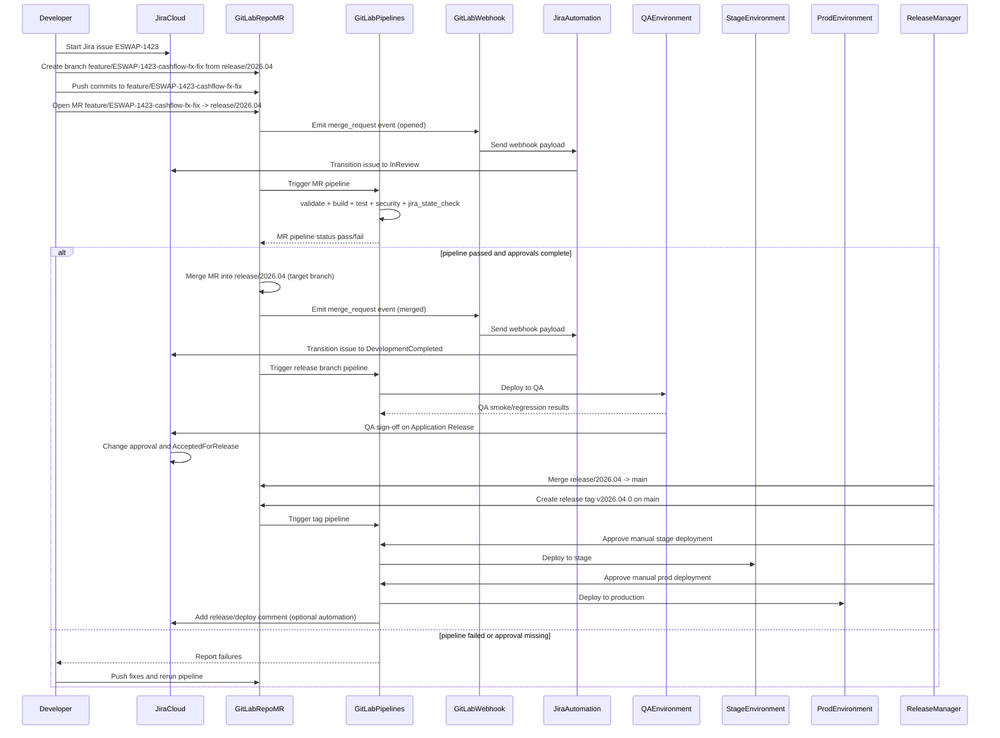
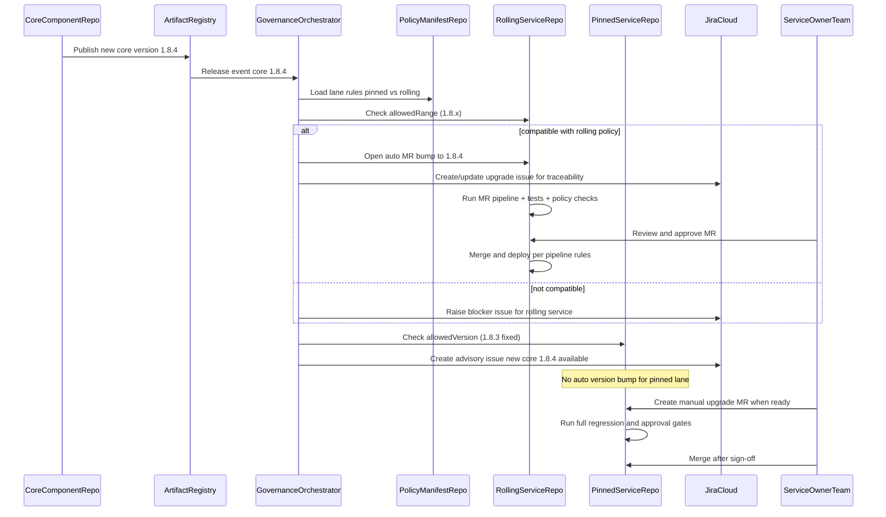
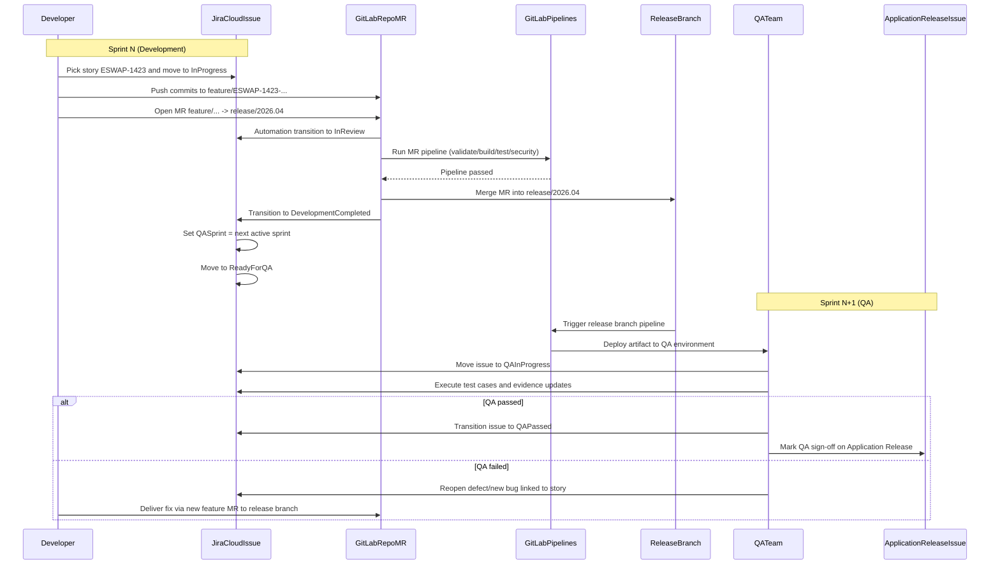

# Jira Cloud + GitLab CI/CD Migration Artifact

## 1) Purpose

This artifact provides an implementation-ready migration blueprint from TeamCity + Bitbucket style workflows to **Jira Cloud + GitLab + GitLab Pipelines** while preserving your existing release governance model:

- Jira issue lifecycle ownership
- Application Release issue type and QA sign-off
- Change approval before production release

### 1.1 Hands-on sandbox project (GitLab)

Use this small GitLab project to run a **real** pipeline, MR, and branch flow without touching production repos:

- **Clone (HTTPS)**: `https://gitlab.com/viswansr/cursor-test-gitlab.git`
- **Project page**: [gitlab.com/viswansr/cursor-test-gitlab](https://gitlab.com/viswansr/cursor-test-gitlab)

Typical first steps: clone the repo, add or edit `.gitlab-ci.yml`, push to `main` or open an MR and watch **Build → Pipelines** in that project.

---

## 2) Target Operating Model

### 2.1 Tool Ownership

- **Jira Cloud**: workflow status, release tracking, QA sign-off, change approval, audit trail.
- **GitLab**: repositories, branching, merge requests, approvals, CI/CD execution, artifacts, deployments.

### 2.2 Branching Strategy

- `main`: protected, releasable baseline.
- `release/<yyyymm_or_version>`: protected release integration branch.
- `feature/<JIRA-KEY>-<short-desc>`: developer work branch.
- Optional hotfix branch: `hotfix/<JIRA-KEY>-<short-desc>`.

### 2.3 Merge Policy

- Merge Request only (no direct push to protected branches).
- Required approvals (minimum 2 for protected targets).
- Required pipeline pass for MR merge.
- Squash merge recommended for cleaner release traceability.

---

## 3) End-to-End Process Steps (Real Example)

1. **Release manager creates** `release/2026.04` from `main`.
2. **Jira issue** `ESWAP-1423` is assigned and moved to In Progress.
3. Developer creates branch `feature/ESWAP-1423-cashflow-fx-fix`.
4. Developer raises MR to `release/2026.04`.
5. MR open event transitions Jira issue to **In Review**.
6. MR approval + passing pipeline allows merge.
7. MR merge transitions Jira issue to **Development Completed**.
8. QA validates all Development Completed issues linked to Application Release.
9. QA sign-off on Application Release issue.
10. Change approval transitions release issues to **Accepted for Release**.
11. Release tag is created and production deploy is manually approved from protected environment.

---

## 4) Sample Flow Diagram

```mermaid
flowchart LR
    jiraIssue[JiraIssue ESWAP-1423] -->|"create branch"| featureBranch[feature_ESWAP_1423]
    featureBranch -->|"open MR"| mergeRequest[mergeRequest to release_2026_04]
    mergeRequest --> mrPipeline[mrPipeline]
    mrPipeline -->|"validate build test security pass"| releaseBranch[release_2026_04]
    mergeRequest -->|"MR opened"| jiraInReview[JiraStatus InReview]
    releaseBranch -->|"MR merged"| jiraDevDone[JiraStatus DevelopmentCompleted]
    jiraDevDone --> qaSignoff[qaSignoff on ApplicationRelease]
    qaSignoff --> changeApproval[changeApproval]
    changeApproval --> releaseTag[releaseTag v2026_04_0]
    releaseTag -->|"manual protected deploy"| prodDeploy[prodDeploy]
    prodDeploy --> jiraReleased[JiraStatus AcceptedForRelease]
```



## 4.1 Sequence Diagram (Required Components and Interactions)

**Branch Flow Legend**
- Dev flow: `feature/* -> release/*`
- Release flow: `release/* -> main -> tag (vX.Y.Z)`
- Hotfix flow: `hotfix/* -> main -> release/*`



---

## 5) Jira Cloud Automation with JSON-Style Payloads

## 5.1 Integration Pattern

Use **GitLab Webhooks** to call **Jira Automation Incoming Webhook** URLs.  
Automation rules parse GitLab payload and transition Jira issues.

Store secrets in:
- GitLab: protected masked variable (for webhook secret if needed)
- Jira: automation rule secret (if calling Jira REST from middleware)

## 5.2 GitLab Merge Request Webhook Payload (Sample)

```json
{
  "object_kind": "merge_request",
  "event_type": "merge_request",
  "user": {
    "name": "developer1",
    "username": "developer1"
  },
  "project": {
    "name": "pb-synth-overall-service-blueprint",
    "web_url": "https://gitlab.example.com/group/project"
  },
  "object_attributes": {
    "iid": 412,
    "title": "ESWAP-1423 Fix cashflow FX rounding",
    "state": "opened",
    "action": "open",
    "source_branch": "feature/ESWAP-1423-cashflow-fx-fix",
    "target_branch": "release/2026.04",
    "url": "https://gitlab.example.com/group/project/-/merge_requests/412"
  }
}
```

## 5.3 Rule A: MR Opened -> In Review

**Trigger**: Incoming webhook in Jira Automation  
**Condition**:
- `{{webhookData.object_kind}}` equals `merge_request`
- `{{webhookData.object_attributes.action}}` equals `open`

**Issue key extraction examples**:
- From title: `{{webhookData.object_attributes.title.match("([A-Z]+-[0-9]+)")}}`
- From branch: `{{webhookData.object_attributes.source_branch.match("([A-Z]+-[0-9]+)")}}`

**Action**:
- Transition issue to **In Review**
- Add comment with MR URL:
  - `MR opened: {{webhookData.object_attributes.url}}`

## 5.4 Rule B: MR Merged -> Development Completed

**Condition**:
- `{{webhookData.object_kind}} == merge_request`
- `{{webhookData.object_attributes.state}} == merged`
- `{{webhookData.object_attributes.target_branch.startsWith("release/")}} == true`

**Action**:
- Transition issue to **Development Completed**
- Add comment:
  - `Merged into {{webhookData.object_attributes.target_branch}}: {{webhookData.object_attributes.url}}`

## 5.5 Pipeline Success Payload (Sample)

```json
{
  "object_kind": "pipeline",
  "object_attributes": {
    "status": "success",
    "ref": "release/2026.04",
    "tag": false,
    "sha": "4f59c8..."
  },
  "project": {
    "web_url": "https://gitlab.example.com/group/project"
  },
  "commit": {
    "message": "ESWAP-1423 Fix cashflow FX rounding"
  }
}
```

## 5.6 Rule C: Release Pipeline Success -> Comment Application Release

**Condition**:
- `{{webhookData.object_kind}} == pipeline`
- `{{webhookData.object_attributes.status}} == success`
- `{{webhookData.object_attributes.ref.startsWith("release/")}} == true`

**Action**:
- Add comment on Application Release issue:
  - `Release pipeline successful for {{webhookData.object_attributes.ref}}`

---

## 6) Stricter `.gitlab-ci.yml` Template (Production-Grade)

```yaml
stages:
  - validate
  - build
  - test
  - security
  - policy
  - package
  - deploy_dev
  - deploy_qa
  - deploy_stage
  - deploy_prod

default:
  image: maven:3.9.6-eclipse-temurin-17
  interruptible: true
  cache:
    key: "$CI_COMMIT_REF_SLUG"
    paths:
      - .m2/repository

workflow:
  rules:
    - if: $CI_PIPELINE_SOURCE == "merge_request_event"
    - if: $CI_COMMIT_BRANCH == "main"
    - if: $CI_COMMIT_BRANCH =~ /^release\/.*/
    - if: $CI_COMMIT_TAG =~ /^v\d+\.\d+\.\d+$/
    - when: never

variables:
  MAVEN_OPTS: "-Dmaven.repo.local=.m2/repository"
  JIRA_BASE_URL: "https://your-domain.atlassian.net"
  # Set these in GitLab CI/CD variables (masked + protected):
  # JIRA_USER_EMAIL
  # JIRA_API_TOKEN

validate:
  stage: validate
  script:
    - mvn -q -DskipTests=true validate
  rules:
    - if: $CI_PIPELINE_SOURCE == "merge_request_event"
    - if: $CI_COMMIT_BRANCH =~ /^release\/.*/
    - if: $CI_COMMIT_BRANCH == "main"

build:
  stage: build
  script:
    - mvn -q -DskipTests=true clean compile
  rules:
    - if: $CI_PIPELINE_SOURCE == "merge_request_event"
    - if: $CI_COMMIT_BRANCH =~ /^release\/.*/
    - if: $CI_COMMIT_BRANCH == "main"

unit_tests:
  stage: test
  script:
    - mvn -q test
  artifacts:
    when: always
    reports:
      junit:
        - "**/target/surefire-reports/*.xml"
  rules:
    - if: $CI_PIPELINE_SOURCE == "merge_request_event"
    - if: $CI_COMMIT_BRANCH =~ /^release\/.*/
    - if: $CI_COMMIT_BRANCH == "main"

dependency_scan:
  stage: security
  script:
    - mvn -q -DskipTests=true org.owasp:dependency-check-maven:check
  allow_failure: false
  rules:
    - if: $CI_PIPELINE_SOURCE == "merge_request_event"
    - if: $CI_COMMIT_BRANCH =~ /^release\/.*/

sast_scan:
  stage: security
  script:
    - echo "Run SAST scanner here"
  allow_failure: false
  rules:
    - if: $CI_PIPELINE_SOURCE == "merge_request_event"
    - if: $CI_COMMIT_BRANCH =~ /^release\/.*/

jira_issue_state_check:
  stage: policy
  image: curlimages/curl:8.7.1
  script:
    - |
      ISSUE_KEY=$(echo "$CI_MERGE_REQUEST_SOURCE_BRANCH_NAME $CI_MERGE_REQUEST_TITLE" | sed -nE 's/.*([A-Z]+-[0-9]+).*/\1/p' | head -n1)
      test -n "$ISSUE_KEY" || (echo "Jira key not found in branch/MR title" && exit 1)
      RESPONSE=$(curl -sS -u "$JIRA_USER_EMAIL:$JIRA_API_TOKEN" \
        "$JIRA_BASE_URL/rest/api/3/issue/$ISSUE_KEY?fields=status")
      STATUS=$(echo "$RESPONSE" | sed -nE 's/.*"name":"([^"]+)".*/\1/p' | head -n1)
      echo "Jira status for $ISSUE_KEY: $STATUS"
      case "$STATUS" in
        "In Progress"|"In Review"|"Development Completed") exit 0 ;;
        *) echo "Jira status not allowed for merge policy"; exit 1 ;;
      esac
  rules:
    - if: $CI_PIPELINE_SOURCE == "merge_request_event"

package:
  stage: package
  script:
    - mvn -q -DskipTests=true package
  artifacts:
    paths:
      - target/*.jar
    expire_in: 14 days
  rules:
    - if: $CI_PIPELINE_SOURCE == "merge_request_event"
    - if: $CI_COMMIT_BRANCH =~ /^release\/.*/
    - if: $CI_COMMIT_BRANCH == "main"
    - if: $CI_COMMIT_TAG =~ /^v\d+\.\d+\.\d+$/

deploy_dev:
  stage: deploy_dev
  script:
    - echo "Deploy immutable artifact to DEV"
  environment:
    name: dev
  rules:
    - if: $CI_COMMIT_BRANCH == "main"

deploy_qa:
  stage: deploy_qa
  script:
    - echo "Deploy release artifact to QA"
  environment:
    name: qa
  rules:
    - if: $CI_COMMIT_BRANCH =~ /^release\/.*/

deploy_stage:
  stage: deploy_stage
  script:
    - echo "Deploy to STAGE with manual approval"
  environment:
    name: stage
  when: manual
  allow_failure: false
  rules:
    - if: $CI_COMMIT_BRANCH =~ /^release\/.*/

deploy_prod:
  stage: deploy_prod
  script:
    - echo "Deploy to PROD from release tag"
  environment:
    name: production
  when: manual
  allow_failure: false
  rules:
    - if: $CI_COMMIT_TAG =~ /^v\d+\.\d+\.\d+$/
```

### 6.1 Required GitLab Branch and Environment Protection

- Protect `main` and `release/*`.
- Require approvals + passing pipeline for merge.
- Protect `production` environment to release manager group only.

### 6.2 Required Secrets

Store as **masked + protected** CI variables:
- `JIRA_USER_EMAIL`
- `JIRA_API_TOKEN`
- deploy credentials (cloud keys/tokens) for each environment

---

## 7) GitLab Webhook Configuration

In GitLab project settings:
- Enable **Merge request events**
- Enable **Pipeline events**
- Target URL: Jira Automation incoming webhook endpoint
- Optional: custom secret header and validation in middleware

---

## 8) 30/60/90 Day Adoption Plan

## First 30 Days (Foundations)

- Configure GitLab branch protections and MR policies.
- Enable basic MR pipelines (validate/build/test).
- Connect Jira Cloud and GitLab dev integration.
- Implement webhook rule for MR opened -> In Review.

## Next 60 Days (Governed Delivery)

- Add security stages (SAST + dependency checks).
- Add Jira issue-state check job in MR pipeline.
- Stand up release branch pipeline and QA deployment.
- Add MR merged -> Development Completed automation.

## Next 90 Days (Production Hardening)

- Enforce protected prod environment and manual deploy approvals.
- Add release tagging policy (`vX.Y.Z`) and release notes generation.
- Add release pipeline success notifications to Application Release issues.
- Add rollback playbook and deployment audit dashboards.

---

## 9) Risk Controls and Rollback Strategy

- **Risk**: webhook automation misses transitions  
  **Control**: nightly reconciliation rule checks MR states vs Jira statuses.

- **Risk**: pipeline gate too strict and blocks teams  
  **Control**: phased enforcement with initial warning mode.

- **Risk**: release drift between Jira and GitLab  
  **Control**: enforce release branch naming + Jira release key mapping.

- **Rollback strategy**:
  - Keep legacy TeamCity jobs in read-only fallback for one release cycle.
  - If GitLab release pipeline fails critically, deploy previous stable tag.
  - Maintain runbook for reverting automation rules independently of pipeline logic.

---

## 10) Day-1 Minimum Viable Configuration Checklist

- [ ] Jira Cloud and GitLab integration enabled
- [ ] Protected `main` and `release/*` branches
- [ ] MR pipeline for validate/build/test
- [ ] At least one MR approval rule enabled
- [ ] Webhook rule for MR opened and merged transitions
- [ ] Release branch deployment to QA
- [ ] Manual production deploy from signed/tagged release

---

## 11) Dependency Upgrade Governance (Pinned vs Rolling)

When a shared core component releases a new version, not every downstream service should behave the same way.  
Use two policy lanes to balance stability and velocity.

### 11.1 Policy Lanes

- **Pinned lane (stability-first)**  
  - Service stays on explicit version (example: `1.8.3`).
  - No auto-upgrade merge.
  - Upgrade only by explicit MR and approval.

- **Rolling lane (velocity-first)**  
  - Service tracks an allowed range/channel (example: `1.8.x`).
  - Bot/automation can open update MR when core publishes new compatible version.
  - Merge only if test + policy gates pass.

### 11.2 Core Component Release Rules

- Follow semantic versioning (`MAJOR.MINOR.PATCH`).
- Publish release notes with:
  - breaking changes
  - migration guidance
  - compatibility matrix
- Trigger downstream dependency governance pipeline after publish.

### 11.3 Central Policy Manifest

Maintain a central policy manifest (in platform-infra repo or shared governance repo):

```yaml
coreDependencyPolicies:
  coreArtifact: "com.company:core-component"
  services:
    trade-capture-service:
      lane: pinned
      allowedVersion: "1.8.3"
      autoMr: false
    valuation-service:
      lane: rolling
      allowedRange: "1.8.x"
      autoMr: true
    cashflow-service:
      lane: pinned
      allowedVersion: "1.8.2"
      autoMr: false
    contract-service:
      lane: rolling
      allowedRange: "1.8.x"
      autoMr: true
```

### 11.4 GitLab CI Enforcement Pattern

Add a dependency governance job in each service pipeline:

```yaml
dependency_policy_check:
  stage: policy
  image: alpine:3.20
  script:
    - echo "Read service lane from policy manifest"
    - echo "Extract current core-component version from pom.xml/build file"
    - echo "Validate pinned services stay at allowedVersion"
    - echo "Validate rolling services stay within allowedRange"
    - echo "Fail if policy violated"
  rules:
    - if: $CI_PIPELINE_SOURCE == "merge_request_event"
```

For rolling services, add a scheduled automation job (or central orchestrator) that:
- Detects new compatible core release.
- Opens MR with dependency bump.
- Tags owning team and links Jira ticket.

### 11.5 Recommended Guardrails

- Block direct dependency bumps to protected branches without MR.
- Require contract/integration tests on dependency bump MRs.
- Require explicit approval from owning team for pinned-lane upgrades.
- Track dependency drift dashboard:
  - latest available core version
  - adopted version by service
  - days behind

### 11.6 Practical Outcome

This model supports both requirements:
- Some services always move to latest compatible core release (rolling lane).
- Other services stay on existing core version until explicitly approved (pinned lane).

### 11.7 Dependency Governance Sequence Diagram



---

## 12) One-Sprint-Behind QA Operating Model

If QA runs one sprint behind development, do not keep dev stories open until QA finishes.  
Instead, separate **dev completion tracking** from **QA validation tracking**.

### 12.1 Recommended Workflow States

- `In Progress` (developer coding)
- `In Review` (MR open/review)
- `Development Completed` (MR merged to release or integration branch)
- `Ready for QA` (queued for QA sprint)
- `QA In Progress`
- `QA Passed` (or `Accepted for Release` if your workflow combines these)

### 12.2 Sprint Handling Rule

- Dev story is completed in sprint **N** when it reaches `Development Completed`.
- QA execution occurs in sprint **N+1** without carrying dev story into dev sprint metrics.
- QA progress is tracked through release issue, linked QA task, or QA board filter.

### 12.3 Jira Field Model (Minimal)

Add these fields:

- `Dev Sprint` (existing sprint assignment)
- `QA Sprint` (custom field, next sprint value)
- `QA Status` (optional if represented directly by workflow state)

### 12.4 Automation Rules (Jira Cloud)

1. **MR Merged -> Development Completed**
   - Trigger: incoming webhook from GitLab MR merged event
   - Action:
     - transition issue to `Development Completed`
     - set `QA Sprint` to next active sprint
     - set status to `Ready for QA` if you use separate QA queue state

2. **QA Starts -> QA In Progress**
   - Trigger: issue moved into QA board column
   - Action: transition to `QA In Progress`

3. **QA Passes -> QA Passed**
   - Trigger: QA sign-off action
   - Action:
     - transition to `QA Passed`
     - add comment with test evidence / environment / release branch

### 12.5 CI/CD Mapping

- Feature/MR pipelines support sprint **N** development.
- Release branch (`release/*`) deploys to QA environment for sprint **N+1** validation.
- Promotion to stage/prod is gated by QA sign-off and change approval, not by dev sprint completion.

### 12.6 Jira Views and JQL (Examples)

**Dev board completion filter** (for velocity):
```text
project = ESWAP AND sprint = currentSprint() AND status in ("Development Completed","Done")
```

**QA backlog filter** (next sprint testing queue):
```text
project = ESWAP AND status in ("Ready for QA","QA In Progress") ORDER BY priority DESC, updated DESC
```

**Release readiness filter**:
```text
project = ESWAP AND fixVersion = "2026.04" AND status not in ("QA Passed","Accepted for Release","Done")
```

### 12.7 Why This Works

- No artificial carry-over of development stories into next sprint.
- Cleaner dev velocity and sprint burn-down reporting.
- QA still has full traceability through Jira states, release issues, and GitLab deployment evidence.

### 12.8 Sequence Diagram (Dev Sprint N, QA Sprint N+1)



