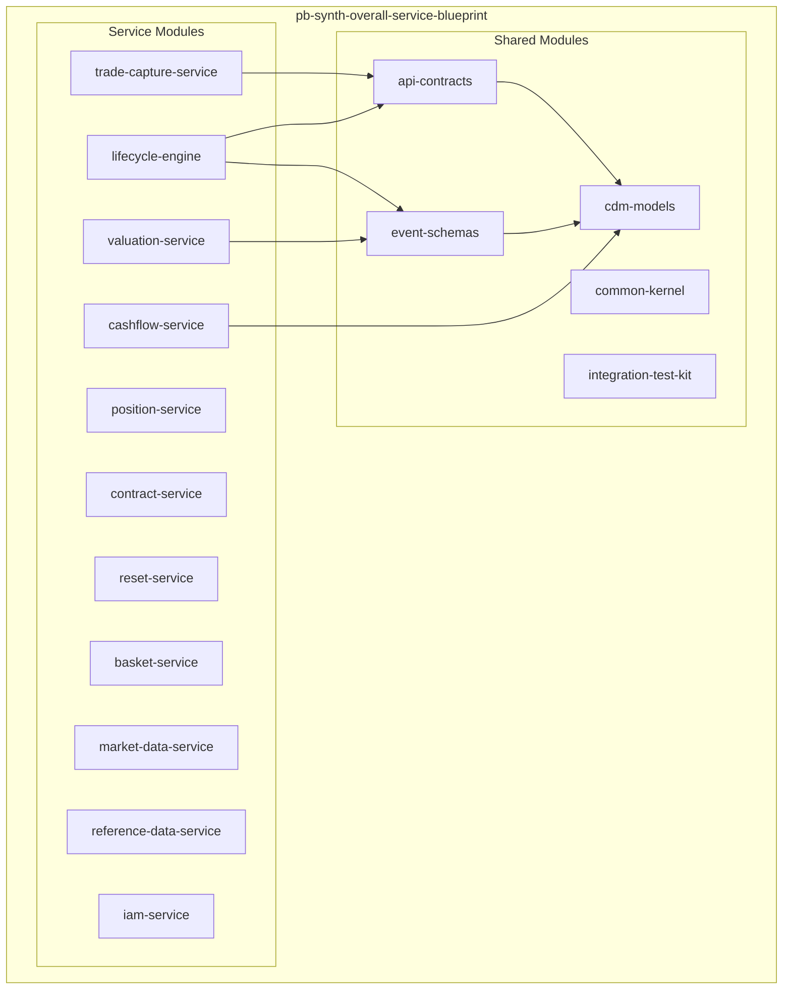
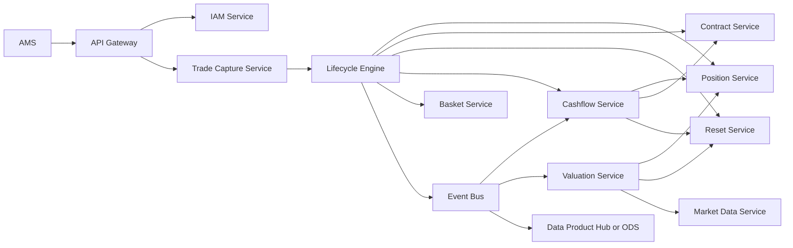

# Pre-Build Design Artifact - Equity Swap Multi-Module Platform

## 1) Purpose

This artifact defines the implementation-ready design before coding begins for a multi-module repository based on:

- `overall-swaps/consolidated_equity_swap_service_guide.md`
- `overall-swaps/multi_basket_multi_ccy_equity_swap_design_and_legal_templates.md`

The goal is to lock service boundaries, module ownership, key interfaces/contracts, and delivery sequence for MVP build-out.

---

## 2) Scope

### In Scope

- Multi-module repo design for core and supporting services
- API contracts between services
- Event contracts via Event Bus
- Multi-basket multi-CCY cashflow and net-settlement behavior
- Build phases and readiness gates

### Out of Scope (for this artifact)

- Full production infra IaC (Kubernetes, Terraform)
- Full legal documentation generation engine
- End-user UI design

---

## 3) Target Service Boundaries

### Core Domain Services

- `trade-capture-service`: intake from AMS, convert input to CDM `ExecutionInstruction` (optimistic pattern)
- `lifecycle-engine`: stateless primitive instruction processor, saga orchestration, event emission
- `position-service`: source of truth for lots/positions, UTI lifecycle, settlement date tracking
- `contract-service`: product/economic/legal terms management
- `cashflow-service`: equity + funding leg calculations, FX conversion, single-currency net settlement
- `reset-service`: market observations/reset history
- `valuation-service`: MTM/cost valuation snapshots
- `basket-service`: basket definitions/versioning/rebalance events (product mechanics)

### Supporting Services

- `market-data-service`: prices/rates/FX ingestion and serving
- `reference-data-service`: securities/accounts/books/parties
- `iam-service`: authn/authz (RBAC + ABAC + function entitlements)

---

## 4) Multi-Module Repository Blueprint

### Shared Module Responsibilities

- `cdm-models`: CDM entities + approved `x-*` extensions (`x-legPairId`, `x-legCurrency`, `x-commonSettlementPolicy`, `x-fxRuleId`)
- `api-contracts`: OpenAPI/Proto definitions and generated clients
- `event-schemas`: business/domain event schemas with compatibility rules
- `common-kernel`: idempotency, error model, tracing context, auth context, date/calendar utilities
- `integration-test-kit`: contract tests, event schema tests, fixture generators

---

## 5) System Interaction Architecture

---

## 6) Service Interfaces and Contracts

## 6.1 Trade Capture -> Lifecycle Engine

- **Purpose**: submit primitive instructions
- **Pattern**: async, idempotent
- **Contract**:
  - `POST /v1/instructions`
  - Request: `PrimitiveInstructionEnvelope`
  - Response: `202 Accepted` + `instructionId`
  - Headers: `Idempotency-Key`, `X-User-Context`, `X-Correlation-Id`

`PrimitiveInstructionEnvelope` (logical schema):

- `instructionType`: `ExecutionInstruction | QuantityChangeInstruction | ResetInstruction | TransferInstruction | ...`
- `tradeKey`
- `payload` (CDM-aligned)
- `metadata` (`sourceSystem`, `receivedAt`, `userContext`)

## 6.2 Lifecycle Engine -> Position Service

- `POST /v1/trade-lots` (create)
- `PATCH /v1/trade-lots/{lotId}/quantity` (increase/decrease/terminate)
- `POST /v1/positions:batchGet` (batch lookup by partition keys)
- `GET /v1/trade-lots/{lotId}/settled-quantity?asOfDate=...`

## 6.3 Lifecycle Engine -> Contract Service

- `GET /v1/products/{productId}`
- `POST /v1/contracts/{contractId}/link-trade`
- `POST /v1/terms:validate`

## 6.4 Lifecycle Engine -> Reset Service

- `POST /v1/resets`
- `GET /v1/resets/{tradeId}/history`

## 6.5 Lifecycle Engine -> Cashflow Service

- `POST /v1/cashflows/schedule`
- `POST /v1/cashflows/settle`
- `POST /v1/cashflows/recalculate`

## 6.6 Cashflow Service Read Dependencies

- Position: settled quantity and settlement date
- Contract: payout/funding terms per leg
- Reset: observed prices/rates
- Market Data: FX rates at fixing time

---

## 7) Event Contracts (Event Bus)

### Core Topics

- `equity.swap.lifecycle.events`
- `equity.swap.position.events`
- `equity.swap.cashflow.events`
- `equity.swap.basket.events`
- `equity.swap.valuation.events`

### Canonical Event Envelope

- `eventId`
- `eventType`
- `eventTime`
- `producer`
- `tradeKey`
- `correlationId`
- `causationId`
- `userContext`
- `payload`
- `schemaVersion`

### Compatibility Rule

- Backward compatible event schema evolution only
- Explicit deprecation window before removing fields

---

## 8) Multi-Basket Multi-CCY Contract Rules

From the multi-CCY design:

1. One `PerformancePayout` pairs exactly with one `InterestRatePayout` via `x-legPairId`
2. Each leg currency (`x-legCurrency`) must map to one FX rule (`x-fxRuleId`)
3. Leg-level economics remain in local currency
4. FX conversion occurs at payment generation time
5. One final net `Transfer` in `x-commonSettlementPolicy.commonSettlementCurrency`

### Contract Ownership

- Contract Service owns economic terms and `x-commonSettlementPolicy`
- Cashflow Service owns conversion/netting execution and final transfer generation
- Lifecycle Engine owns eventing and state transition orchestration

---

## 9) Non-Functional Requirements (MVP Targets)

- Trade throughput: >= 2M/day
- E2E batch processing window: <= 25 minutes
- API P99 (critical reads): <= 50 ms
- Batch position query (1000 keys) P99: <= 50 ms
- Report freshness from ODS: <= 15 minutes
- Idempotency: exactly-once observable outcomes per instruction key

---

## 10) Build Plan and Sequencing

### Phase 1 - Foundations

- Create modules: `cdm-models`, `api-contracts`, `event-schemas`, `common-kernel`, `integration-test-kit`
- Freeze base contracts and event envelope

### Phase 2 - Core Transaction Path

- Implement `trade-capture-service`, `lifecycle-engine`, `position-service`, `contract-service`
- Support `ExecutionInstruction` and `QuantityChangeInstruction`

### Phase 3 - Cashflow and Reset

- Implement `reset-service` and `cashflow-service`
- Implement settlement date-aware interest and FX conversion/netting

### Phase 4 - Analytics and Basket

- Implement `valuation-service` and `basket-service`
- Add basket version events and valuation consumption

### Phase 5 - Hardening

- IAM integration, observability, retry/DLQ, chaos and load tests

---

## 11) Definition of Ready Before Coding

All must be true:

- Service boundaries approved
- OpenAPI/Proto contracts baselined
- Event envelope and topic naming approved
- Error model and idempotency strategy approved
- Multi-CCY contract rules approved
- Test strategy for contract and schema compatibility agreed

---

## 12) Risks and Mitigations

- **Risk**: contract drift across services  
  **Mitigation**: generated clients from `api-contracts`, contract tests in CI

- **Risk**: event schema breakage  
  **Mitigation**: schema compatibility checks in CI with version policy

- **Risk**: FX/netting inconsistencies  
  **Mitigation**: deterministic rounding/fixing policy and golden test vectors

- **Risk**: saga partial failures  
  **Mitigation**: compensation handlers + replay tooling + dead letter workflow

---

## 13) Immediate Next Deliverables

1. `api-contracts` initial OpenAPI stubs for 6 critical endpoints
2. `event-schemas` initial envelopes and 5 event types
3. `cdm-models` package with approved extension fields
4. Sequence diagram pack for:
   - New trade (optimistic)
   - Conflict resolution
   - Reset + transfer
   - Multi-CCY cashflow settlement
