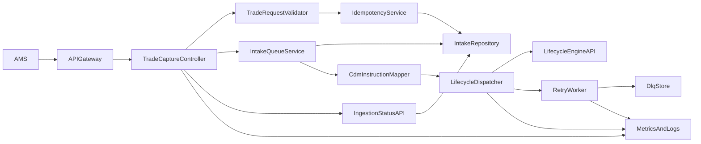

# Trade Capture Service - Architecture

## Runtime Architecture

## Internal Components

- `TradeCaptureController`
  - handles contract endpoints and header extraction
- `TradeRequestValidator`
  - contract and business validation
- `IdempotencyService`
  - duplicate detection and dedupe semantics
- `IntakeRepository`
  - durable ingestion records and status updates
- `IntakeQueueService`
  - accepted record queuing and worker handoff
- `CdmInstructionMapper`
  - maps inbound trade payload to `ExecutionInstruction` envelope
- `LifecycleDispatcher`
  - async sender to lifecycle API with correlation context
- `RetryWorker`
  - retry scheduling and DLQ transitions

## Data Model (Core)

- `IngestionRecord`
  - `ingestionId`
  - `idempotencyKey`
  - `tradeExternalId`
  - `sourceSystem`
  - `status`
  - `requestPayloadJson`
  - `errorCode`, `errorMessage`
  - `attemptCount`
  - `createdAt`, `updatedAt`
  - `correlationId`, `userContext`

## Status Semantics

- `ACCEPTED`: valid request persisted and accepted
- `QUEUED`: waiting for lifecycle dispatch
- `SENT_TO_LIFECYCLE`: lifecycle accepted instruction
- `FAILED`: terminal failure after retries exhausted

## API Clarifications Resolved For Build

- Keep batch endpoint path as `/v1/trades:batch` to match current contract
- Batch duplicate idempotency returns `409` with `ErrorResponse`
- Batch endpoint accepts optional `X-User-Context` (same as single endpoint)
- `ErrorResponse.code` canonical values:
  - `VALIDATION_ERROR`
  - `DUPLICATE_IDEMPOTENCY_KEY`
  - `LIFECYCLE_DISPATCH_ERROR`
  - `INGESTION_NOT_FOUND`
  - `INTERNAL_ERROR`
- Polling guidance:
  - terminal statuses: `SENT_TO_LIFECYCLE`, `FAILED`
  - non-terminal statuses: `ACCEPTED`, `QUEUED`
